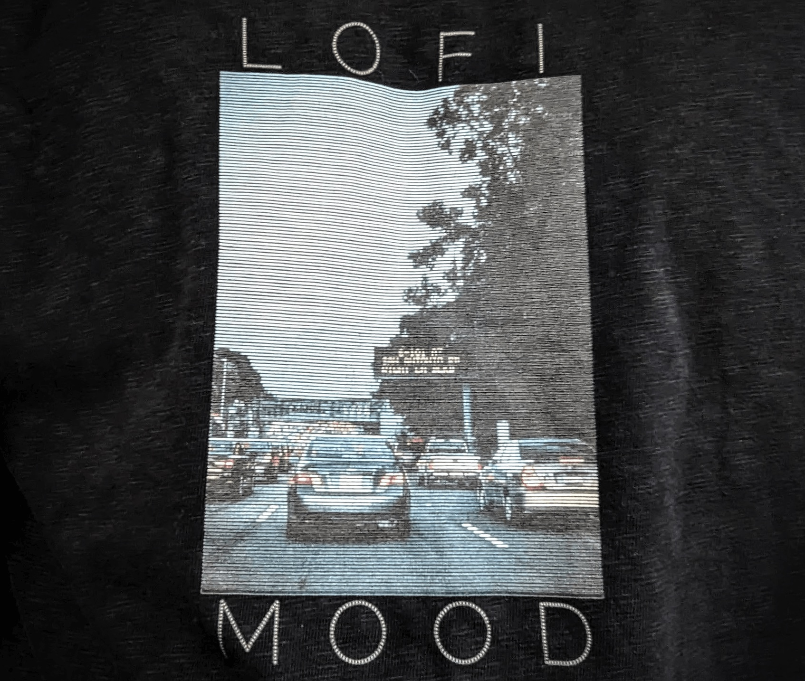

# lofi-stripes

[](https://conventionalcommits.org)

A web application for creating lofi t-shirt prints.
Built with js, wasm and rust.

## Example



## Development

Source files are located in `./src`, the build results are in `./docs`
(to serve them using GitHub pages).

```bash
# build and run locally on http://localhost:8001/:
make run_release # fast
make run_debug # really slow, but with readable perf profile

# clear all build artifacts and run locally:
make clean_and_run_release
make clean_and_run_debug

# watch typescript changes (useful to run in parallel):
make watch_ts
```

See [Makefile](./Makefile) for more commands.

## Deployment

```bash
# build:
make build_release

# git commit ...
```

## Credits

- [Raleway Dots font](https://fonts.google.com/specimen/Raleway+Dots/about?query=raleway+dots) designed by Matt McInerney, Pablo Impallari, Rodrigo Fuenzalida, Brenda Gallo

## License

[MIT License](./LICENSE)
